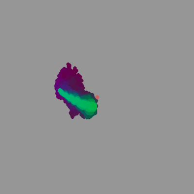
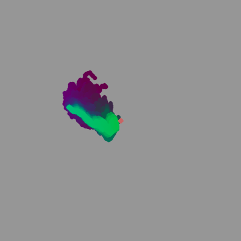

# probabilistic-model-based-rl
Model-Based Reinforcement Learning with Probabilistic Models

A demonstration of model-based reinforcement learning, with probabilistic models. 
Based on [PETS](https://arxiv.org/abs/1805.12114) and [PDDM](https://bair.berkeley.edu/blog/2019/09/30/deep-dynamics/).

A simple 3D point mass environment, created to allow for visualisations of the trajectory optimization procedure.

